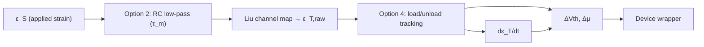

# strained-device-model

**A Time-Varying, Direction-Dependent Compact Model of Mechanical Strain Effects in Thin-Film Transistors**

[](https://creativecommons.org/licenses/by/4.0/)
[](https://www.python.org/downloads/)
[](https://github.com/SJTU-YONGFU-RESEARCH-GRP/strained-device-model)

**Repository:** [SJTU-YONGFU-RESEARCH-GRP/strained-device-model](https://github.com/SJTU-YONGFU-RESEARCH-GRP/strained-device-model)

This repository implements **A Time-Varying, Direction-Dependent Compact Model of Mechanical Strain Effects in Thin-Film Transistors**: a **device-agnostic strain-aware SPICE wrapper** and Python workflow to wrap **one user `.subckt` at a time**, run **ngspice** simulations, and generate pre/post strain comparison figures plus a markdown report. The strain engine implements a **direction-aware** channel-strain map (Liu et al., IEEE TNANO 2022) and optional **dynamic extensions**—mechanical bandwidth, strain-rate sensitivity, hysteresis, and transient strain profiles—that realize the time-varying compact model. Reference **BSIM3/BSIM4** MOS subcircuits and matching YAML configs are included for evaluation.

## Table of contents

- [Problem statement](#problem-statement)
- [Motivation](#motivation)
- [Innovation](#innovation)
- [Features](#features)
- [Strain model](#strain-model)
  - [Static core](#static-core)
  - [Single device vs. omni-directional TFT](#single-device-vs-omni-directional-tft)
  - [Dynamic device extensions (Options 1–4)](#dynamic-device-extensions-options-14)
- [Requirements](#requirements)
- [Quick start](#quick-start)
  - [Installation](#installation)
  - [Run a BSIM evaluation](#run-a-bsim-evaluation)
  - [Wrap a custom device](#wrap-a-custom-device)
- [Evaluation models](#evaluation-models)
- [Outputs](#outputs)
- [Configuration](#configuration)
  - [Dynamic and transient options](#dynamic-and-transient-options)
- [Python API](#python-api)
- [Project layout](#project-layout)
- [Development](#development)
- [License](#license)
- [References](#references)
- [Citation](#citation)

## Problem statement

Flexible and stretchable electronics—especially thin-film transistors (TFTs) in wearable biomedical front-ends—operate under mechanical loading from respiration, limb motion, and substrate bending. External tensile strain alters channel geometry and carrier transport, shifting threshold voltage and mobility in ways that depend on both strain magnitude and the angle of the applied force relative to the device. Conventional compact models such as BSIM3/BSIM4 do not expose mechanical strain as a simulation input, so circuit designers cannot systematically predict how strain distorts analog front-end performance (gain, offset, and signal integrity) before fabrication. Closing this gap requires a direction-aware mapping from mechanical loading to device parameters, and a practical way to attach that mapping to arbitrary SPICE subcircuits already in a design flow.

## Motivation

The Liu et al. (IEEE TNANO 2022) work demonstrated **omni-directional TFT front-end circuits**—systems that remain functional under tensile loading from varying directions by aligning a force-insensitive axis and auto-calibrating multiple devices, improving ECG/EMG acquisition SNR from strongly negative values to positive dB under simulated strain. That circuit strategy builds on a **direction-aware channel-strain map** for individual TFTs. To extend that physical insight beyond a single technology or hand-crafted netlist, this repository targets **pre-silicon exploration** of the per-device map: wrapping one device model at a time, running automated DC and transient comparisons in ngspice, and producing reproducible figures and reports. Researchers and circuit designers working on flexible sensing, strain-resilient front-ends, or TFT-based systems can quantify direction-dependent degradation and evaluate compensation strategies in simulation rather than relying solely on post-fabrication measurement.

## Innovation

This work contributes:

1. **Device-agnostic strain wrapper** — A generated `strain_aware_device` subcircuit wraps any user `.subckt` (TFT, BSIM MOS, or custom compact model) without rewriting the underlying model equations. Strain enters through control voltages for applied strain ε_S and force angle α; the wrapper applies an effective gate shift and optional mobility control.

2. **Direction-aware channel-strain map** — Implements the Liu et al. static mapping from (ε_S, α, ν) to channel strain ε_T and linearized ΔVth/Δμ shifts. A wrapped **single** device has fixed channel orientation and an **anisotropic** response (ε_T and ΔVth/Δμ vary with force angle α). The workflow sweeps both strain magnitude and direction to characterize that dependence—not to turn one transistor into an omni-directional TFT.

3. **Dynamic strain extensions** — Four optional layers beyond the static reference model: transient strain profiles (Option 1), mechanical bandwidth / RC lag on ε_S (Option 2), strain-rate sensitivity (Option 3), and asymmetric load/unload hysteresis (Option 4)—available in both embedded SPICE (`strain_engine_spice`) and Verilog-A (`va/strain_engine.va`).

4. **End-to-end open workflow** — YAML-driven configuration, automatic testbench generation, ngspice batch execution, SVG/CSV export, and markdown reporting (`strain-spice run`), with reference BSIM3/BSIM4 evaluations for reproducible benchmarking.

- **Repository**: https://github.com/SJTU-YONGFU-RESEARCH-GRP/strained-device-model
- **Python package**: `strain-spice` (`src/strain_spice/`)
- **Entry point**: `strain-spice run`
- **Evaluation models**: `models/` with configs in `configs/`
- **License**: CC BY 4.0 (see [LICENSE](LICENSE))

## Features

- Wrap any user SPICE subcircuit with a generated **strain-aware wrapper** (`strain_wrap.inc`).
- Map external mechanical loading to channel strain, then to threshold and mobility shifts (direction-dependent for a single wrapped device).
- **Static model** (Liu et al., IEEE TNANO 2022) for DC sweeps, plus optional **dynamic extensions** for time-varying and rate-dependent behavior.
- Run baseline (unwrapped) and strained **DC and transient** simulations with ngspice.
- Export **SVG figures**, **CSV tables**, and a **markdown comparison report** (including dynamic parameter tables when enabled).
- Ship reference **BSIM3v3** and **BSIM4** NMOS/PMOS evaluation netlists for ngspice.
- Optional **Verilog-A** strain engine (`va/strain_engine.va`) for Spectre-style flows.

## Strain model

The wrapper implements the mechanical and electrical mapping from Liu et al. (IEEE TNANO 2022), extended with device-level dynamic effects for time-varying loading.

### Static core

**Channel strain** from applied strain `ε_S` and force angle `α` (rad):

```
ε_T = (ε_S / 2) · [1 − ν + (1 + ν) cos(2α)]
```

**Parameter shifts** (linearized):

```
Vth_eff = Vth0 − β · ε_T
μ_eff   = μ0  + γ · ε_T
```

The generated SPICE wrapper applies threshold shift through an effective gate-voltage source (`E_gshift`). When `mobility_control_port` is set in the YAML config, mobility modulation is routed to a device control port; BSIM evaluation configs use **threshold-shift-only** coupling.

### Single device vs. omni-directional TFT

Three terms are easy to conflate; they mean different things in this project:

| Term | Scope | What it means here |
| --- | --- | --- |
| **Channel-strain map** | Per device | Physics relating applied strain ε_S and force angle α to effective channel strain ε_T (equations above). |
| **Wrapped single device** | One `.subckt` | A transistor with fixed channel orientation. Its electrical response is **direction-dependent**—for example, ε_T is largest near α = 0 and can be negative near α = π/2. |
| **Omni-directional TFT** (Liu et al.) | Circuit / system | A **front-end design strategy**—layout, calibration, and often multiple devices—to keep performance acceptable when strain may arrive from many directions. Not produced by the wrapper alone. |

Use magnitude and direction sweeps to quantify how **one** device responds under loading. Exploring omni-directional or auto-calibrated front-end architectures from Liu et al. is a separate circuit-design step built on top of these per-device models.

### Dynamic device extensions (Options 1–4)

Four optional extensions model mechanical lag, strain-rate sensitivity, and load/unload asymmetry. They are implemented in the embedded `strain_engine_spice` subcircuit (and mirrored in `va/strain_engine.va` for Verilog-A flows):



| Option | YAML keys | Effect |
| --- | --- | --- |
| 1. Time-varying strain | `transient.enabled`, `transient.profile` | `.tran` testbench with sine or PWL strain sources |
| 2. Mechanical bandwidth | `dynamic.mechanical_tau` | RC low-pass on `ε_S` before the Liu channel map |
| 3. Strain-rate terms | `dynamic.beta_r`, `dynamic.gamma_r` | Adds `dε_T/dt` to ΔVth and Δμ |
| 4. Hysteresis | `dynamic.hysteresis.*` | Asymmetric load/unload tracking on `ε_T` |

**Combined dynamic equations** (when Options 2–4 are active):

```
ε_S,eff = LP(ε_S; τ_m)
ε_T,raw = (ε_S,eff / 2) · [1 − ν + (1 + ν) cos(2α)]
dε_T/dt = (ε_T,raw − ε_T) / τ_eff     where τ_eff = τ_load if loading, τ_unload if unloading
Vth_eff = Vth0 − β · ε_T − β_r · dε_T/dt
μ_eff   = μ0  + γ · ε_T + γ_r · dε_T/dt
```

Set all dynamic values to zero (or leave defaults) to recover the original static model. Option 1 only affects how `ε_S` and `α` are driven in simulation; Options 2–4 change the strain-to-parameter mapping inside the engine.

Implementation details live in `src/strain_spice/strain_math.py` (Python reference) and `src/strain_spice/generator.py` (SPICE netlist generation).

## Requirements

- **Python** 3.10+
- **ngspice** on `PATH` (batch mode, `-b`)
- Python dependencies (installed with the package):
  - `matplotlib`
  - `numpy`
  - `pyyaml`

Optional:

- **OpenVAF** — compile `va/strain_engine.va` to OSDI if you extend the flow for Verilog-A in ngspice
- **Cadence Spectre** — use `va/strain_engine.va` with an AHDL include in your own netlist flow

## Quick start

### Installation

```bash
git clone https://github.com/SJTU-YONGFU-RESEARCH-GRP/strained-device-model.git
cd strained-device-model

python3 -m venv .venv
source .venv/bin/activate
pip install -e ".[dev]"
```

Verify ngspice is available:

```bash
ngspice -v
```

### Run a BSIM evaluation

```bash
strain-spice run \
  --device models/bsim4_nmos.subckt \
  --config configs/bsim4_nmos.yaml \
  --output results/bsim4_nmos
```

Other bundled configs:

```bash
strain-spice run --device models/bsim3_nmos.subckt --config configs/bsim3_nmos.yaml --output results/bsim3_nmos
strain-spice run --device models/bsim3_pmos.subckt --config configs/bsim3_pmos.yaml --output results/bsim3_pmos
strain-spice run --device models/bsim4_pmos.subckt --config configs/bsim4_pmos.yaml --output results/bsim4_pmos
strain-spice run --device models/bsim4l14_nmos.subckt --config configs/bsim4l14_nmos.yaml --output results/bsim4l14_nmos
```

**Dynamic strain evaluation** (Options 1–4 enabled):

```bash
strain-spice run \
  --device models/bsim4_nmos.subckt \
  --config configs/bsim4_nmos_dynamic.yaml \
  --output results/bsim4_nmos_dynamic
```

This adds transient testbenches (`tb_*_transient.cir`), dynamic parameter-shift plots, and a drain-current-vs-time comparison figure alongside the standard DC sweep outputs.

Run **all** bundled evaluations (static + dynamic):

```bash
./scripts/run_all.sh
```

### Wrap a custom device

1. Provide a `.subckt` netlist with at least `d`, `g`, and `s` ports.
2. Copy a config from `configs/` and set `device.subckt`, port names, bias, and strain coefficients.
3. Run:

```bash
strain-spice run \
  --device path/to/your_device.subckt \
  --config path/to/your_config.yaml \
  --output results/your_device
```

For BSIM-style models, set `mobility_control_port: null` (threshold shift only). To also modulate mobility, add a control port (for example `dmu_ctrl`) to your subcircuit and reference it in the config.

## Evaluation models

Reference MOS subcircuits under `models/`:

| Model file | Type | ngspice level | Matching config |
|------------|------|---------------|-----------------|
| `models/bsim3_nmos.subckt` | NMOS | 8 (BSIM3v3) | `configs/bsim3_nmos.yaml` |
| `models/bsim3_pmos.subckt` | PMOS | 8 (BSIM3v3) | `configs/bsim3_pmos.yaml` |
| `models/bsim4_nmos.subckt` | NMOS | 54 (BSIM4) | `configs/bsim4_nmos.yaml`, `configs/bsim4_nmos_dynamic.yaml` |
| `models/bsim4_pmos.subckt` | PMOS | 54 (BSIM4) | `configs/bsim4_pmos.yaml` |
| `models/bsim4l14_nmos.subckt` | NMOS | 14 (BSIM4 alt.) | `configs/bsim4l14_nmos.yaml` |

Each subcircuit exposes `d g s b` and accepts instance parameters `W` and `L`. Model cards use generic 180 nm-class parameters for **relative strain comparison**, not foundry sign-off. See [models/README.md](models/README.md) for notes on PMOS biasing and parameter replacement.

## Outputs

Each run writes to the directory passed to `--output`:

| Artifact | Description |
|----------|-------------|
| `strain_wrap.inc` | Generated strain engine + wrapper + embedded device |
| `tb_baseline_*.cir`, `tb_strained_*.cir` | ngspice testbenches (DC magnitude, direction, transfer) |
| `tb_*_transient.cir` | Transient testbenches (when `transient.enabled: true`) |
| `*.csv` | Parsed DC and transient sweep tables |
| `figures/*.svg` | Pre/post comparison plots |
| `figures/transient_comparison.svg` | Drain current vs time under dynamic strain (transient runs) |
| `figures/transient_controls.svg` | ΔVth and Δμ vs time (transient runs) |
| `strain_comparison_report.md` | Summary report with static/dynamic parameters, metrics, and embedded figures |

## Configuration

YAML configs control device port mapping, strain coefficients, bias, and sweeps. Minimal schema:

```yaml
device:
  subckt: bsim4_nmos
  drain_port: d
  gate_port: g
  source_port: s
  bulk_port: b
  mobility_control_port: null
  instance_params:
    W: 10u
    L: 180n

strain:
  nu: 0.47      # Poisson's ratio
  beta: 0.8     # threshold sensitivity
  gamma: 0.0    # mobility sensitivity
  vth0: 0.40
  mu0: 0.04

bias:
  vdd: 1.0
  vgs: 0.75
  vss: 0.0

sweeps:
  strain_magnitude:
    eps_s_max: 0.005
    steps: 11
    alpha: 0.0
  strain_direction:
    eps_s: 0.005
    alpha_max: 1.5707963267948966
    steps: 17
  transfer:
    enabled: true
    vgs_min: 0.0
    vgs_max: 1.2
    steps: 25
    eps_s_cases: [0.0, 0.0025, 0.005]
    alpha: 0.0
```

Strain inputs are encoded as control voltages in simulation (`0.005` V corresponds to `0.5%` strain).

### Dynamic and transient options

Add `dynamic` and `transient` blocks to enable the extended model. Omit them (or use zero defaults) for static-only runs:

```yaml
dynamic:
  mechanical_tau: 0.05      # Option 2: RC time constant on ε_S [s]; 0 = disabled
  beta_r: 2.0               # Option 3: threshold strain-rate sensitivity
  gamma_r: 0.0              # Option 3: mobility strain-rate sensitivity
  hysteresis:               # Option 4: asymmetric load/unload tracking
    enabled: true
    tau_load: 0.02          # loading time constant [s]
    tau_unload: 0.10        # unloading time constant [s]

transient:
  enabled: true             # Option 1: generate .tran testbenches
  tstop: 5.0                # simulation end time [s]
  tstep: 0.01               # time step [s]
  profile:
    type: sine              # sine | pwl | dc
    amplitude: 0.005        # peak strain (0.005 = 0.5%)
    frequency: 0.3          # Hz (sine/pwl)
    offset: 0.0
    alpha: 0.0              # fixed force angle [rad]
    alpha_rate: 0.0         # optional dα/dt [rad/s]; uses a behavioral source when non-zero
```

See `configs/bsim4_nmos_dynamic.yaml` for a complete working example with all four options enabled.

## Python API

```python
from pathlib import Path

from strain_spice import StrainSpiceConfig, run_pipeline

config = StrainSpiceConfig.from_yaml(Path("configs/bsim4_nmos.yaml"))
result = run_pipeline(
    device_path=Path("models/bsim4_nmos.subckt"),
    config=config,
    output_dir=Path("results/bsim4_nmos"),
)

print(result.report_path)
print(result.figure_paths)
```

## Project layout

```text
strained-device-model/
├── configs/                 # YAML configs for bundled BSIM evaluations
├── models/                  # Reference BSIM .subckt netlists
├── src/strain_spice/        # Python package (generator, simulator, report)
├── tests/                   # pytest suite
├── va/                      # Verilog-A strain engine (optional Spectre/OSDI path)
├── pyproject.toml
├── LICENSE
└── README.md
```

## Development

```bash
pytest
ruff check src tests
./scripts/readme_to_pdf.sh          # README.md -> README.pdf (use --use-kroki for Mermaid without mmdc)
```

## License

This project is licensed under [CC BY 4.0](https://creativecommons.org/licenses/by/4.0/). See [LICENSE](LICENSE).

Bundled BSIM model cards are generic reference parameters. Replace them with your PDK or foundry terms when used outside research comparison workflows.

## References

- **SJTU Yongfu Research Group**, “A Time-Varying, Direction-Dependent Compact Model of Mechanical Strain Effects in Thin-Film Transistors” — open implementation in this repository ([github.com/SJTU-YONGFU-RESEARCH-GRP/strained-device-model](https://github.com/SJTU-YONGFU-RESEARCH-GRP/strained-device-model)).
- Y. Liu et al., “Tensile-Force-Resilient Biomedical Front-End Circuits Employing Auto-Calibrated Omni-Directional Thin-Film Transistors,” *IEEE Trans. Nanotechnol.*, vol. 21, pp. 575–585, 2022. [DOI: 10.1109/TNANO.2022.3208555](https://doi.org/10.1109/TNANO.2022.3208555)
- [ngspice](https://ngspice.sourceforge.io/) circuit simulator
- [models/README.md](models/README.md) — evaluation device notes

## Citation

If you use this software in academic work, please cite the compact-model work and this repository. For the underlying direction-aware channel-strain map, also cite Liu et al. (2022) below.

```bibtex
@article{strained_device_model_compact,
  title  = {A Time-Varying, Direction-Dependent Compact Model of Mechanical Strain Effects in Thin-Film Transistors},
  author = {{SJTU Yongfu Research Group}},
  year   = {2026},
  note   = {Open implementation: \url{https://github.com/SJTU-YONGFU-RESEARCH-GRP/strained-device-model}}
}
```

```bibtex
@software{strained_device_model,
  title        = {strained-device-model: Strain-aware SPICE wrapper and simulation workflow},
  author       = {{SJTU Yongfu Research Group}},
  year         = {2026},
  url          = {https://github.com/SJTU-YONGFU-RESEARCH-GRP/strained-device-model},
  license      = {CC-BY-4.0}
}
```

```bibtex
@article{Liu2022TensileForceResilient,
  author  = {Liu, Yaxin and Ma, Zhouchen and Liu, Hongyi and Lin, Waner and Wei, Jing and Chen, Sujie and Lin, Chen and Li, Yongfu and Zhao, Jian},
  title   = {Tensile-Force-Resilient Biomedical Front-End Circuits Employing Auto-Calibrated Omni-Directional Thin-Film Transistors},
  journal = {IEEE Transactions on Nanotechnology},
  volume  = {21},
  pages   = {575--585},
  year    = {2022},
  doi     = {10.1109/TNANO.2022.3208555}
}
```
