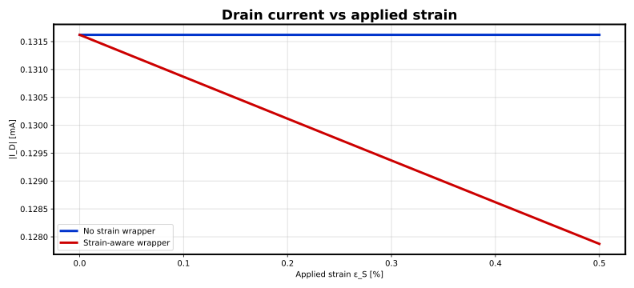
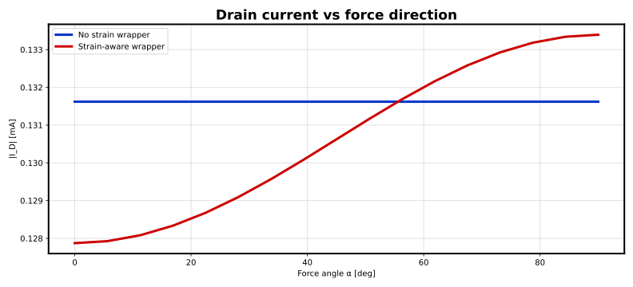
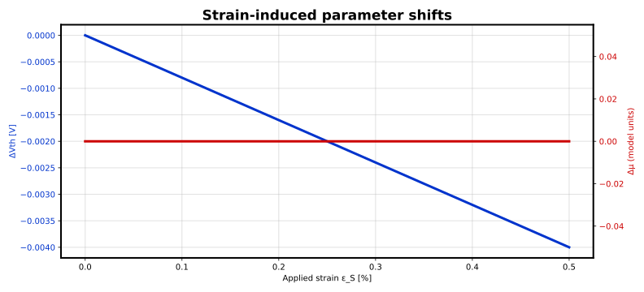
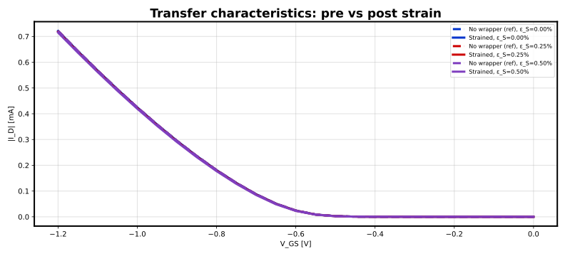

# BSIM3 PMOS strain evaluation

Generated: 2026-06-03 15:47 UTC

## Overview

This report compares simulations **without** the strain wrapper (baseline device only)
and **with** the generated strain-aware wrapper subcircuit.

- Device netlist: `/home/yongfu/proj/strained-device-model/models/bsim3_pmos.subckt`
- Wrapper output directory: `/home/yongfu/proj/strained-device-model/results/bsim3_pmos`

## Strain model parameters

| Parameter | Value | Description |
| --- | --- | --- |
| ν | 0.47 | Substrate Poisson's ratio |
| β | 0.8 | Threshold voltage sensitivity |
| γ | 0.0 | Mobility sensitivity |
| Vth0 | 0.42 | Unstrained threshold reference |
| μ0 | 0.015 | Unstrained mobility reference |

## Dynamic device model parameters

| Parameter | Value | Description |
| --- | --- | --- |
| τ_m | 0.0 | Mechanical low-pass time constant [s] (Option 2) |
| β_r | 0.0 | Threshold strain-rate sensitivity (Option 3) |
| γ_r | 0.0 | Mobility strain-rate sensitivity (Option 3) |
| Hysteresis | disabled | Asymmetric load/unload tracking (Option 4) |
| τ_load | 0.05 | Channel-strain loading time constant [s] |
| τ_unload | 0.2 | Channel-strain unloading time constant [s] |

## Summary metrics

| Case | Baseline &#124;I_D&#124; [A] | Strained &#124;I_D&#124; [A] | Relative change [%] |
| --- | --- | --- | --- |
| Strain magnitude sweep | 0.000131621 | 0.000127874 | -2.847 |
| Strain direction sweep (mean) | 0.000131621 | 0.00013063 | -0.753 |

## Figures

### Drain current vs applied strain



### Drain current vs force direction



### Strain-induced parameter shifts



### Transfer characteristics



## Strain magnitude sweep data (sample)

| v-sweep | v(eps_s) | v(alpha) | vdd#branch |
| --- | --- | --- | --- |
| 0 | 0 | 0 | 0.000131621 |
| 0.0005 | 0.0005 | 0 | 0.000131244 |
| 0.001 | 0.001 | 0 | 0.000130869 |
| 0.002 | 0.002 | 0 | 0.000130118 |
| 0.0025 | 0.0025 | 0 | 0.000129743 |
| 0.0035 | 0.0035 | 0 | 0.000128994 |
| 0.004 | 0.004 | 0 | 0.00012862 |
| 0.005 | 0.005 | 0 | 0.000127874 |

## Strain direction sweep data (sample)

| v-sweep | v(eps_s) | v(alpha) | vdd#branch |
| --- | --- | --- | --- |
| 0 | 0.005 | 0 | 0.000127874 |
| 0.19635 | 0.005 | 0.19635 | 0.000128082 |
| 0.392699 | 0.005 | 0.392699 | 0.000128677 |
| 0.589049 | 0.005 | 0.589049 | 0.000129569 |
| 0.883573 | 0.005 | 0.883573 | 0.000131163 |
| 1.07992 | 0.005 | 1.07992 | 0.000132161 |
| 1.27627 | 0.005 | 1.27627 | 0.000132927 |
| 1.5708 | 0.005 | 1.5708 | 0.000133395 |

## Transfer sweep notes

- ε_S = 0.000%: peak |I_D| baseline = 0.000721425 A, strained = 0.000721425 A, Δ = 0.00%
- ε_S = 0.250%: peak |I_D| baseline = 0.000721425 A, strained = 0.00071826 A, Δ = -0.44%
- ε_S = 0.500%: peak |I_D| baseline = 0.000721425 A, strained = 0.000715097 A, Δ = -0.88%

## How to reproduce

```bash
strain-spice run --device /home/yongfu/proj/strained-device-model/models/bsim3_pmos.subckt --config <your-config.yaml> --output /home/yongfu/proj/strained-device-model/results/bsim3_pmos
```
