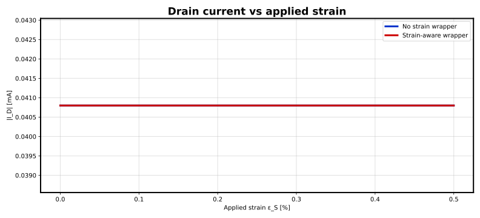
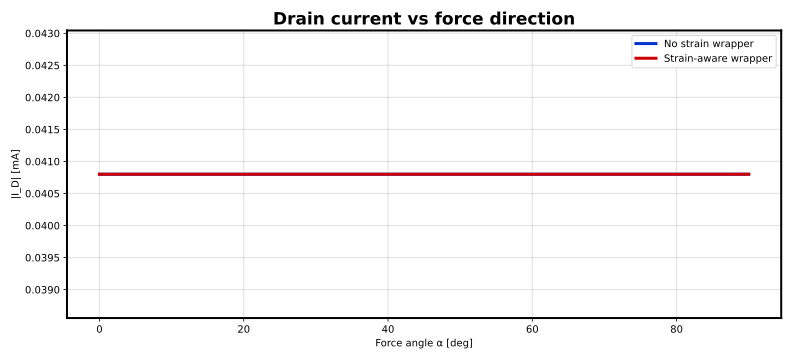
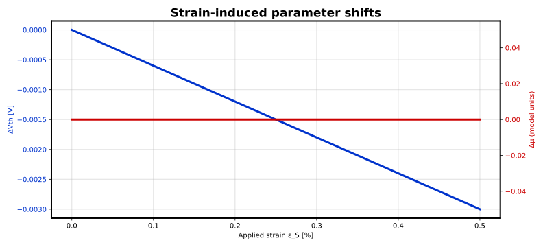
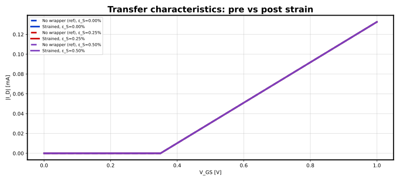

# Strain demo MOS (ngspice + Spectre validation)

Generated: 2026-06-03 15:48 UTC

## Overview

This report compares simulations **without** the strain wrapper (baseline device only)
and **with** the generated strain-aware wrapper subcircuit.

- Device netlist: `/home/yongfu/proj/strained-device-model/models/strain_demo_mos.subckt`
- Wrapper output directory: `/home/yongfu/proj/strained-device-model/results/strain_demo_spectre`

## Strain model parameters

| Parameter | Value | Description |
| --- | --- | --- |
| ν | 0.47 | Substrate Poisson's ratio |
| β | 0.6 | Threshold voltage sensitivity |
| γ | 0.0 | Mobility sensitivity |
| Vth0 | 0.35 | Unstrained threshold reference |
| μ0 | 0.02 | Unstrained mobility reference |

## Dynamic device model parameters

| Parameter | Value | Description |
| --- | --- | --- |
| τ_m | 0.0 | Mechanical low-pass time constant [s] (Option 2) |
| β_r | 0.0 | Threshold strain-rate sensitivity (Option 3) |
| γ_r | 0.0 | Mobility strain-rate sensitivity (Option 3) |
| Hysteresis | disabled | Asymmetric load/unload tracking (Option 4) |
| τ_load | 0.05 | Channel-strain loading time constant [s] |
| τ_unload | 0.2 | Channel-strain unloading time constant [s] |

## Summary metrics

| Case | Baseline &#124;I_D&#124; [A] | Strained &#124;I_D&#124; [A] | Relative change [%] |
| --- | --- | --- | --- |
| Strain magnitude sweep | 4.08e-05 | 4.08e-05 | 0.000 |
| Strain direction sweep (mean) | 4.08e-05 | 4.08e-05 | 0.000 |

## Figures

### Drain current vs applied strain



### Drain current vs force direction



### Strain-induced parameter shifts



### Transfer characteristics



## Strain magnitude sweep data (sample)

| dc | v(eps_s) | v(alpha) | i(Vdd) |
| --- | --- | --- | --- |
| 0 | 0 | 0 | -4.08e-05 |
| 0.000625 | 0.000625 | 0 | -4.08e-05 |
| 0.00125 | 0.00125 | 0 | -4.08e-05 |
| 0.001875 | 0.001875 | 0 | -4.08e-05 |
| 0.0025 | 0.0025 | 0 | -4.08e-05 |
| 0.003125 | 0.003125 | 0 | -4.08e-05 |
| 0.00375 | 0.00375 | 0 | -4.08e-05 |
| 0.005 | 0.005 | 0 | -4.08e-05 |

## Strain direction sweep data (sample)

| dc | v(eps_s) | v(alpha) | i(Vdd) |
| --- | --- | --- | --- |
| 0 | 0.005 | 0 | -4.08e-05 |
| 0.1309 | 0.005 | 0.1309 | -4.08e-05 |
| 0.392699 | 0.005 | 0.392699 | -4.08e-05 |
| 0.654498 | 0.005 | 0.654498 | -4.08e-05 |
| 0.785398 | 0.005 | 0.785398 | -4.08e-05 |
| 1.0472 | 0.005 | 1.0472 | -4.08e-05 |
| 1.309 | 0.005 | 1.309 | -4.08e-05 |
| 1.5708 | 0.005 | 1.5708 | -4.08e-05 |

## Transfer sweep notes

- ε_S = 0.000%: peak |I_D| baseline = 0.0001326 A, strained = 0.0001326 A, Δ = 0.00%
- ε_S = 0.250%: peak |I_D| baseline = 0.0001326 A, strained = 0.0001326 A, Δ = 0.00%
- ε_S = 0.500%: peak |I_D| baseline = 0.0001326 A, strained = 0.0001326 A, Δ = 0.00%

## How to reproduce

```bash
strain-spice run --device /home/yongfu/proj/strained-device-model/models/strain_demo_mos.subckt --config <your-config.yaml> --output /home/yongfu/proj/strained-device-model/results/strain_demo_spectre
```
