# BSIM4 NMOS transient profile library (ngspice)

Generated: 2026-06-05 08:46 UTC

## Overview

This report compares simulations **without** the strain wrapper (baseline device only)
and **with** the generated strain-aware wrapper subcircuit.

- Device netlist: `/home/yongfu/proj/strained-device-model/models/bsim4_nmos.subckt`
- Wrapper output directory: `/home/yongfu/proj/strained-device-model/results/transient_profiles_ngspice`

## Strain model parameters

| Parameter | Value | Description |
| --- | --- | --- |
| ν | 0.47 | Substrate Poisson's ratio |
| β | 0.8 | Threshold voltage sensitivity |
| γ | 0.0 | Mobility sensitivity |
| Vth0 | 0.4 | Unstrained threshold reference |
| μ0 | 0.04 | Unstrained mobility reference |

## Dynamic device model parameters

| Parameter | Value | Description |
| --- | --- | --- |
| τ_m | 0.05 | Mechanical low-pass time constant [s] (Option 2) |
| β_r | 2.0 | Threshold strain-rate sensitivity (Option 3) |
| γ_r | 0.0 | Mobility strain-rate sensitivity (Option 3) |
| Hysteresis | enabled | Asymmetric load/unload tracking (Option 4) |
| τ_load | 0.02 | Channel-strain loading time constant [s] |
| τ_unload | 0.1 | Channel-strain unloading time constant [s] |

## Summary metrics

| Case | Baseline &#124;I_D&#124; [A] | Strained &#124;I_D&#124; [A] | Relative change [%] |
| --- | --- | --- | --- |
| Strain magnitude sweep | 0.00024057 | 0.000251412 | 4.507 |
| Strain direction sweep (mean) | 0.00024057 | 0.000243452 | 1.198 |

## Transient profile comparison

| Profile | Peak Δ [%] | RMS Δ [%] | Peak-to-peak Δ [%] | Phase lag [ms] |
| --- | --- | --- | --- | --- |
| sine | 0.000 | -39.208 | — | -350.000 |
| drift | 0.000 | -34.006 | — | -330.000 |
| abrupt | 0.000 | 0.000 | 0.000 | 0.000 |
| pulse | 0.000 | -36.932 | — | 400.000 |
| pwl | 0.000 | -36.651 | — | -340.000 |
| custom | 0.000 | -37.824 | — | -350.000 |

## Transient summary metrics (sine)

| Metric | Baseline &#124;I_D&#124; [A] | Strained &#124;I_D&#124; [A] | Relative change [%] |
| --- | --- | --- | --- |
| Peak | 0.00024057 | 0.00024057 | 0.000 |
| RMS | 0.00024057 | 0.000146249 | -39.208 |
| Peak-to-peak | 0 | 0.00024057 | — |

Phase lag of |I_D| behind applied ε_S (strained case, `sine`): **-350.000 ms** (-0.35 s), estimated by cross-correlation.

## Transient summary metrics (drift)

| Metric | Baseline &#124;I_D&#124; [A] | Strained &#124;I_D&#124; [A] | Relative change [%] |
| --- | --- | --- | --- |
| Peak | 0.00024057 | 0.00024057 | 0.000 |
| RMS | 0.00024057 | 0.000158763 | -34.006 |
| Peak-to-peak | 0 | 0.00024057 | — |

Phase lag of |I_D| behind applied ε_S (strained case, `drift`): **-330.000 ms** (-0.33 s), estimated by cross-correlation.

## Transient summary metrics (abrupt)

| Metric | Baseline &#124;I_D&#124; [A] | Strained &#124;I_D&#124; [A] | Relative change [%] |
| --- | --- | --- | --- |
| Peak | 0.00024057 | 0.00024057 | 0.000 |
| RMS | 0.00024057 | 0.00024057 | 0.000 |
| Peak-to-peak | 0 | 0 | 0.000 |

Phase lag of |I_D| behind applied ε_S (strained case, `abrupt`): **0.000 ms** (0 s), estimated by cross-correlation.

## Transient summary metrics (pulse)

| Metric | Baseline &#124;I_D&#124; [A] | Strained &#124;I_D&#124; [A] | Relative change [%] |
| --- | --- | --- | --- |
| Peak | 0.00024057 | 0.00024057 | 0.000 |
| RMS | 0.00024057 | 0.000151724 | -36.932 |
| Peak-to-peak | 0 | 0.00024057 | — |

Phase lag of |I_D| behind applied ε_S (strained case, `pulse`): **400.000 ms** (0.4 s), estimated by cross-correlation.

## Transient summary metrics (pwl)

| Metric | Baseline &#124;I_D&#124; [A] | Strained &#124;I_D&#124; [A] | Relative change [%] |
| --- | --- | --- | --- |
| Peak | 0.00024057 | 0.00024057 | 0.000 |
| RMS | 0.00024057 | 0.000152399 | -36.651 |
| Peak-to-peak | 0 | 0.00024057 | — |

Phase lag of |I_D| behind applied ε_S (strained case, `pwl`): **-340.000 ms** (-0.34 s), estimated by cross-correlation.

## Transient summary metrics (custom)

| Metric | Baseline &#124;I_D&#124; [A] | Strained &#124;I_D&#124; [A] | Relative change [%] |
| --- | --- | --- | --- |
| Peak | 0.00024057 | 0.00024057 | 0.000 |
| RMS | 0.00024057 | 0.000149576 | -37.824 |
| Peak-to-peak | 0 | 0.00024057 | — |

Phase lag of |I_D| behind applied ε_S (strained case, `custom`): **-350.000 ms** (-0.35 s), estimated by cross-correlation.

## Figures

### Drain current vs applied strain

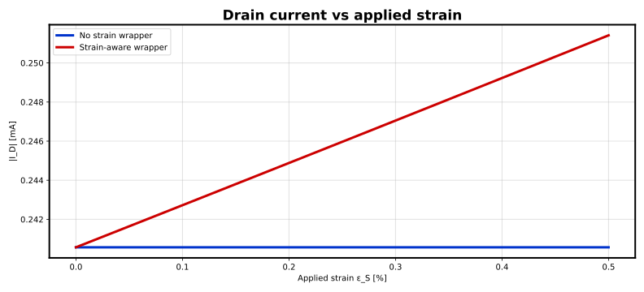

### Drain current vs force direction

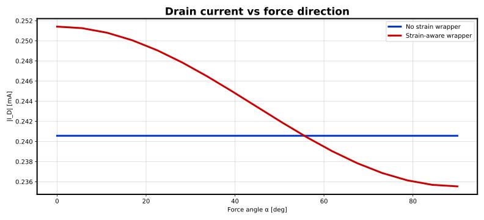

### Strain-induced parameter shifts

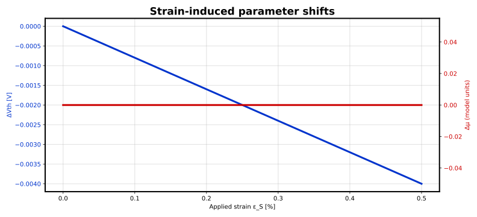

### Transfer characteristics

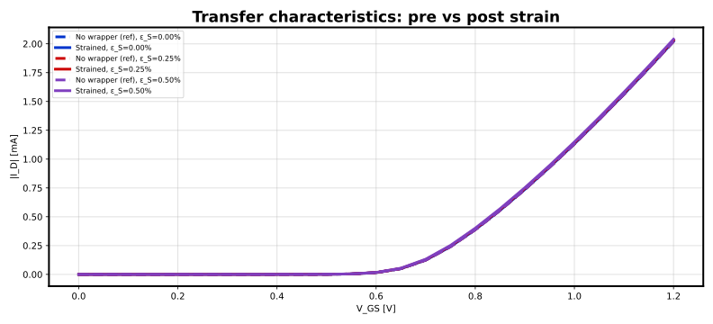

### Dynamic transient response (sine)

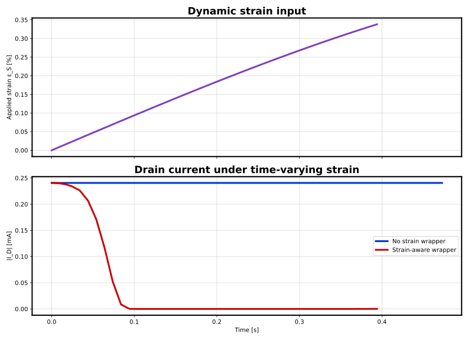

### Dynamic parameter shifts (sine)

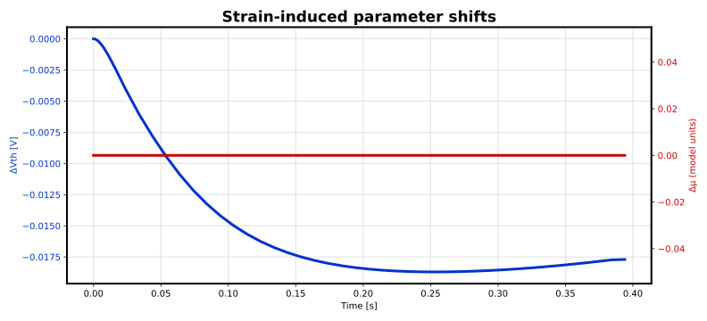

### Dynamic transient response (drift)

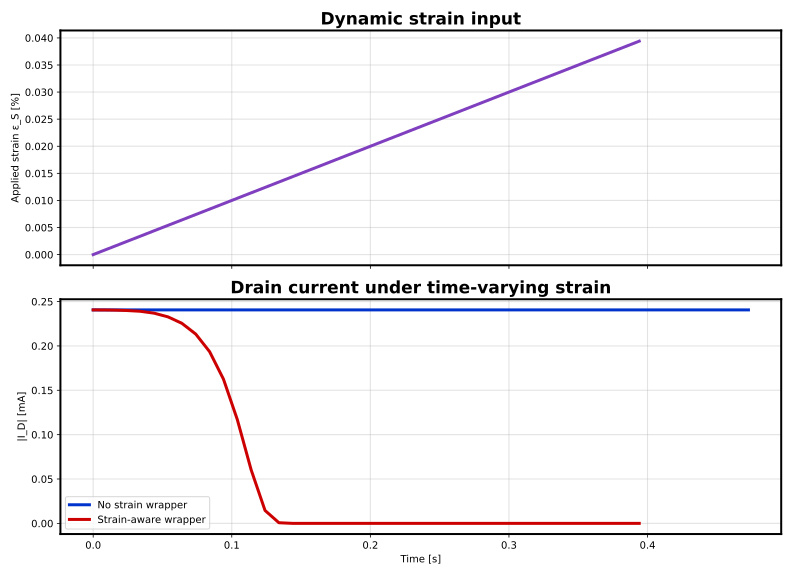

### Dynamic parameter shifts (drift)

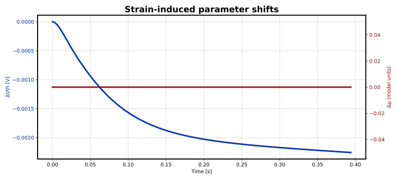

### Dynamic transient response (abrupt)

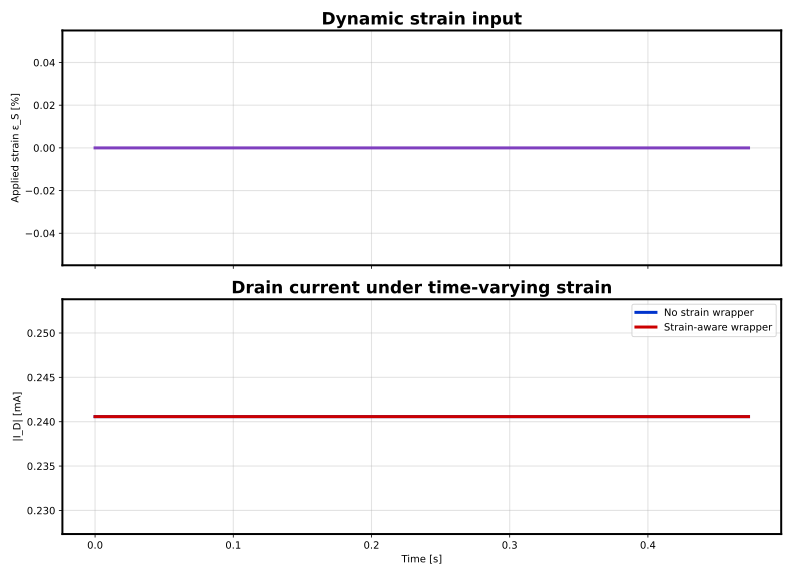

### Dynamic parameter shifts (abrupt)

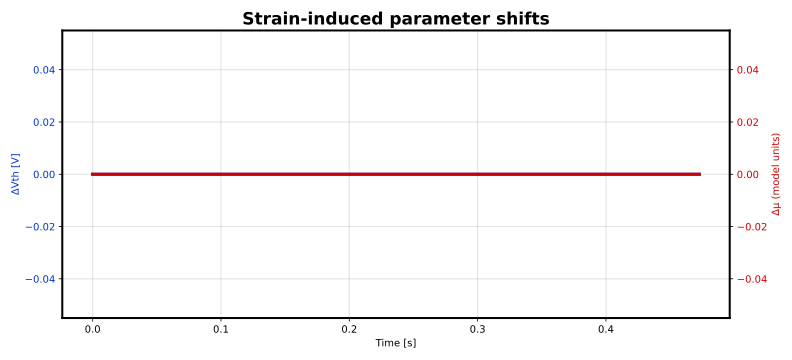

### Dynamic transient response (pulse)

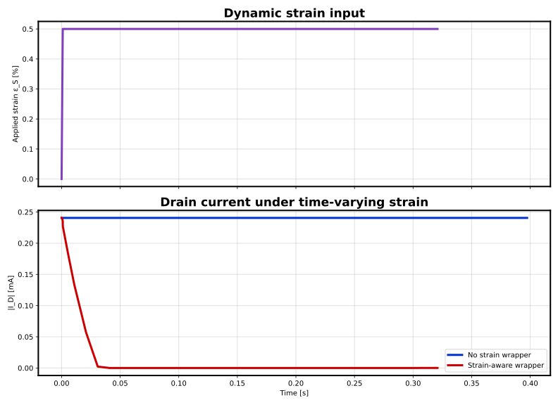

### Dynamic parameter shifts (pulse)

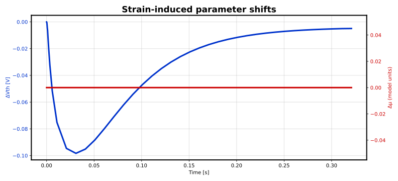

### Dynamic transient response (pwl)

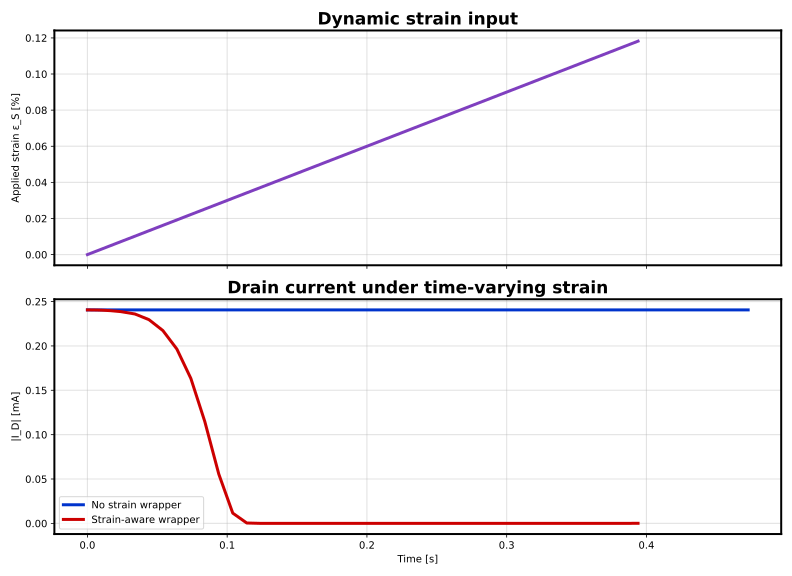

### Dynamic parameter shifts (pwl)

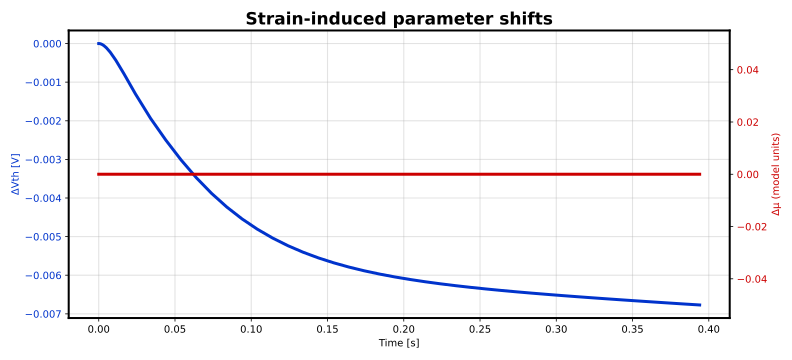

### Dynamic transient response (custom)

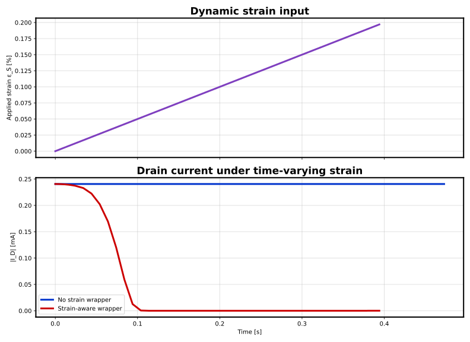

### Dynamic parameter shifts (custom)


## Strain magnitude sweep data (sample)

| v-sweep | v(eps_s) | v(alpha) | vdd#branch |
| --- | --- | --- | --- |
| 0 | 0 | 0 | -0.00024057 |
| 0.0005 | 0.0005 | 0 | -0.000241645 |
| 0.001 | 0.001 | 0 | -0.000242723 |
| 0.002 | 0.002 | 0 | -0.000244884 |
| 0.0025 | 0.0025 | 0 | -0.000245967 |
| 0.0035 | 0.0035 | 0 | -0.00024814 |
| 0.004 | 0.004 | 0 | -0.000249229 |
| 0.005 | 0.005 | 0 | -0.000251412 |

## Strain direction sweep data (sample)

| v-sweep | v(eps_s) | v(alpha) | vdd#branch |
| --- | --- | --- | --- |
| 0 | 0.005 | 0 | -0.000251412 |
| 0.19635 | 0.005 | 0.19635 | -0.000250801 |
| 0.392699 | 0.005 | 0.392699 | -0.000249062 |
| 0.589049 | 0.005 | 0.589049 | -0.000246469 |
| 0.883573 | 0.005 | 0.883573 | -0.000241878 |
| 1.07992 | 0.005 | 1.07992 | -0.000239032 |
| 1.27627 | 0.005 | 1.27627 | -0.000236863 |
| 1.5708 | 0.005 | 1.5708 | -0.000235542 |

## Transfer sweep notes

- ε_S = 0.000%: peak |I_D| baseline = 0.00202137 A, strained = 0.00202137 A, Δ = 0.00%
- ε_S = 0.250%: peak |I_D| baseline = 0.00202137 A, strained = 0.00203077 A, Δ = 0.47%
- ε_S = 0.500%: peak |I_D| baseline = 0.00202137 A, strained = 0.00204018 A, Δ = 0.93%

## Transient time series (sample) (sine)

| time | v(eps_s) | v(alpha) | vdd#branch |
| --- | --- | --- | --- |
| 0 | 0 | 0 | -0.00024057 |
| 0.000438258 | 4.13048e-06 | 0 | -0.000240568 |
| 0.0111966 | 0.000105518 | 0 | -0.000239437 |
| 0.0840042 | 0.000788417 | 0 | -8.51279e-06 |
| 0.154004 | 0.00143116 | 0 | -1.69064e-12 |
| 0.234004 | 0.00213462 | 0 | -4.25401e-11 |
| 0.314004 | 0.00278963 | 0 | -2.47461e-09 |
| 0.394004 | 0.00338133 | 0 | -1.47274e-07 |

## Transient strain profile notes (sine)

- Profile: `sine` — sine (offset = 0.000%, amplitude = 0.500%, frequency = 0.3 Hz)
- Simulation window: 0 to 5 s (step = 0.01 s)
- Full transient CSV: `tb_strained_transient_sine.csv`, `tb_baseline_transient_sine.csv`

## Transient time series (sample) (drift)

| time | v(eps_s) | v(alpha) | vdd#branch |
| --- | --- | --- | --- |
| 0 | 0 | 0 | -0.00024057 |
| 0.000438258 | 4.38258e-07 | 0 | -0.00024057 |
| 0.0111965 | 1.11965e-05 | 0 | -0.00024045 |
| 0.0840035 | 8.40035e-05 | 0 | -0.000193519 |
| 0.154003 | 0.000154004 | 0 | -1.17923e-12 |
| 0.234004 | 0.000234003 | 0 | -5.40938e-12 |
| 0.314003 | 0.000314003 | 0 | -2.63813e-10 |
| 0.394004 | 0.000394003 | 0 | -1.56485e-08 |

## Transient strain profile notes (drift)

- Profile: `drift` — drift (offset = 0.000%, rate = 0.1 %/s, end = 0.500% at t = 5 s)
- Simulation window: 0 to 5 s (step = 0.01 s)
- Full transient CSV: `tb_strained_transient_drift.csv`, `tb_baseline_transient_drift.csv`

## Transient time series (sample) (abrupt)

| time | v(eps_s) | v(alpha) | vdd#branch |
| --- | --- | --- | --- |
| 0 | 0 | 0 | -0.00024057 |
| 0.0064 | 0 | 0 | -0.00024057 |
| 0.0828 | 0 | 0 | -0.00024057 |
| 0.1628 | 0 | 0 | -0.00024057 |
| 0.2328 | 0 | 0 | -0.00024057 |
| 0.3128 | 0 | 0 | -0.00024057 |
| 0.3928 | 0 | 0 | -0.00024057 |
| 0.4728 | 0 | 0 | -0.00024057 |

## Transient strain profile notes (abrupt)

- Profile: `abrupt` — abrupt step (before = 0.000%, after = 0.500% at t = 1 s)
- Simulation window: 0 to 5 s (step = 0.01 s)
- Full transient CSV: `tb_strained_transient_abrupt.csv`, `tb_baseline_transient_abrupt.csv`

## Transient time series (sample) (pulse)

| time | v(eps_s) | v(alpha) | vdd#branch |
| --- | --- | --- | --- |
| 0 | 0 | 0 | -0.00024057 |
| 4.38594e-05 | 0.000219297 | 0 | -0.00024056 |
| 0.001 | 0.005 | 0 | -0.000234925 |
| 0.0109097 | 0.005 | 0 | -0.000133041 |
| 0.0808583 | 0.005 | 0 | -1.48527e-12 |
| 0.160858 | 0.005 | 0 | -2.69348e-11 |
| 0.240858 | 0.005 | 0 | -1.54221e-09 |
| 0.320858 | 0.005 | 0 | -9.17579e-08 |

## Transient strain profile notes (pulse)

- Profile: `pulse` — pulse (offset = 0.000%, amplitude = 0.500%, frequency = 0.3 Hz, duty = 0.5)
- Simulation window: 0 to 5 s (step = 0.01 s)
- Full transient CSV: `tb_strained_transient_pulse.csv`, `tb_baseline_transient_pulse.csv`

## Transient time series (sample) (pwl)

| time | v(eps_s) | v(alpha) | vdd#branch |
| --- | --- | --- | --- |
| 0 | 0 | 0 | -0.00024057 |
| 0.000438258 | 1.31477e-06 | 0 | -0.00024057 |
| 0.0111965 | 3.35895e-05 | 0 | -0.000240209 |
| 0.0840035 | 0.00025201 | 0 | -0.000114701 |
| 0.154003 | 0.000462009 | 0 | -1.21635e-12 |
| 0.234004 | 0.000702009 | 0 | -1.42369e-11 |
| 0.314003 | 0.000942008 | 0 | -7.89447e-10 |
| 0.394004 | 0.00118201 | 0 | -4.69435e-08 |

## Transient strain profile notes (pwl)

- Profile: `pwl` — triangle PWL (offset = 0.000%, amplitude = 0.500%, frequency = 0.3 Hz)
- Simulation window: 0 to 5 s (step = 0.01 s)
- Full transient CSV: `tb_strained_transient_pwl.csv`, `tb_baseline_transient_pwl.csv`

## Transient time series (sample) (custom)

| time | v(eps_s) | v(alpha) | vdd#branch |
| --- | --- | --- | --- |
| 0 | 0 | 0 | -0.00024057 |
| 0.000438258 | 2.19129e-06 | 0 | -0.000240569 |
| 0.0111965 | 5.59826e-05 | 0 | -0.000239969 |
| 0.0840035 | 0.000420017 | 0 | -5.92049e-05 |
| 0.154003 | 0.000770017 | 0 | -1.3768e-12 |
| 0.234004 | 0.00117002 | 0 | -2.30778e-11 |
| 0.314003 | 0.00157002 | 0 | -1.3151e-09 |
| 0.394004 | 0.00197002 | 0 | -7.82386e-08 |

## Transient strain profile notes (custom)

- Profile: `custom` — custom PWL (4 points)
- Simulation window: 0 to 5 s (step = 0.01 s)
- Full transient CSV: `tb_strained_transient_custom.csv`, `tb_baseline_transient_custom.csv`

## How to reproduce

```bash
strain-spice run --device /home/yongfu/proj/strained-device-model/models/bsim4_nmos.subckt --config <your-config.yaml> --output /home/yongfu/proj/strained-device-model/results/transient_profiles_ngspice
```
